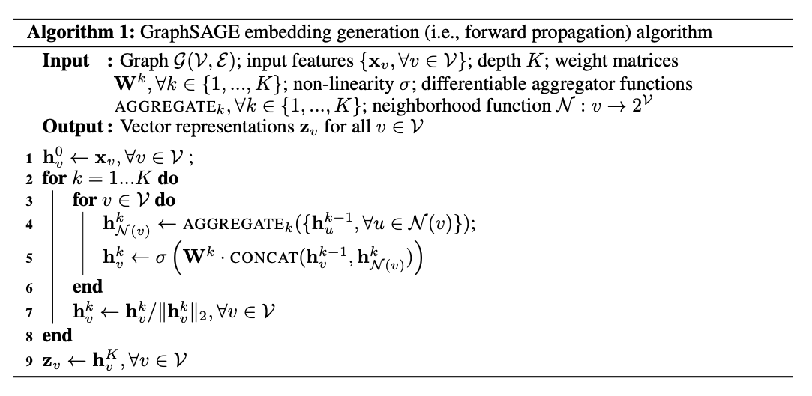

# Inductive Representation Learning on Large Graphs

## Summary
- Importance of node embeddings
- Restrictions of former approaches 
    - Generalization to unseen nodes
    - Feature and structured information
- Idea of GraphSAGE
    - Advantages of GraphSAGE

## Introduction
- The idea of graph embeddings
    - Dimensionality reduction
    - Use of node embeddings (classification, clustering, link prediction)
- Modern needs of real-world applications
    - Unseen nodes
    - Complete sub-graphs
    - Recognize local and global structural properties of nodes based on neighborhood
    - Computationaly expensive
- Recent approaches using convolutions
- Proposed solution (GraphSAGE)
    - Deals with structured data (mention some examples)
    - Graphs without node features
    - Learns to combine information of node's local neighborhood
    - Unsupervised loss function that works without being specific on the task
    - Learn node's representation

## Related work
- Learning over graph structures and its limitations
    - Graph Convolutional Networks

## GraphSAGE
The algorithm combine feature details from node's local neighborhood by learning a set of aggregation functions.
<!-- Insert image of the algorithm -->

### Forward propagation algorithm (Embedding generation)
Once learned the parameters of $K$ aggregator functions $\textrm{AGGREGATE}_k$ and the set of weight matrices $\mathbf M^k$ for every $k\in\{1,2,...,K\}$
<!-- They are used to propagate information through the nodes between different layers of the model-->

## Unsupervised setting
It would be applied a graph-based loss function 
In order to learn the parameters of GraphSAGE and get useful-predictive representations of nodes in an unsupervised manner
$$J_G(\mathbf z_u) = -\log{\left( \sigma(\mathbf z_u^\top \mathbf z_v) \right)} - Q\cdot\mathbb E_{v_n\sim P_n(v)}{\log{\left(\sigma(-\mathbf z_u^\top \mathbf z_{v_n})\right)} }$$

### Negative sampling
There should be an adaptation in the notion of similarity in the objective function when training the model.
When two vectors are similar, their dot product is similar

## Aggregator functions
An ideal aggregator function would be invariant to permutations of its inputs without losing representional capacity. 
### Mean aggregator
$$\mathbf h_v^k = \sigma\left( \mathbf W\cdot \textrm{MEAN}\left( \left\{\mathbf h_v^{k-1} \right\} \cup \left\{\mathbf h_u^{k-1}, \forall u\in \mathcal N(v) \right\}  \right)\right)$$

### LSTM aggregator

### Pooling aggregator
$$\textrm{AGGREGATE}_k^{pool} = \max{\left\{ \sigma\left(\mathbf W_{pool}\mathbf h_{u_i}^k + \mathbf b, \forall u_i\in\mathcal N(v) \right)\right\}}$$

## Conclusions
- Limitations of GraphSAGE
- Takes a lot of time tu run on big graphs
